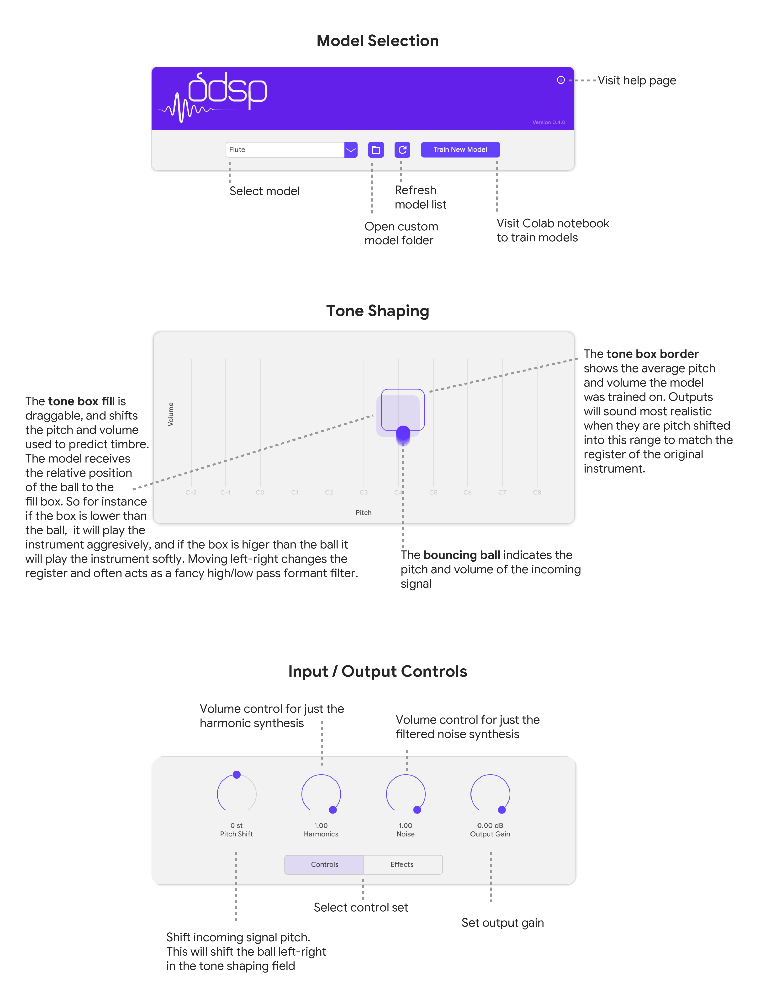

# Getting Started #

* There are two types of plugins, DDSP Effect and DDSP Synth.
    * DDSP Effect
        * This is an audio effect that expects audio input and transforms the incoming audio signal.
        * A monophonic signal works best for a clean and musical result. However, we encourage experimenting with any input to create interesting textures!
    * DDSP Synth
        * This is a MIDI synthesizer plugin that expects MIDI input and generates an audio signal.
        * This version exposes an extra set of parameters to control the ADSR envelope of generated audio signal.
* The effects tab consists of a reverb and output gain control.
* Fun tip: The tone control parameters (Input Pitch and Input Gain) are exposed to the DAW, try assigning an LFO to either/both to add some movement to the generated output.
* If you experience a failure/crash, please file an issue on GitHub and we will take a look.
* If you have questions or tips, feel free to post them on our [discord server](https://discord.gg/eyzhzMJMx5).

 

## [How to train your DDSP](https://g.co/magenta/train-ddsp-vst) ##

The plugins come with 11 embedded models. If you want to train and use your own model, follow these instructions:

1. Procure a 10-20 minute file of a **monophonic** (one note at a time) recording of an instrument you want to train. Training typically takes ~2-3 hours with free tier Colab.
2. Follow the directions in the [training colab](https://g.co/magenta/train-ddsp-vst) and download the trained `.tflite` model.
4. Click the "Folder" icon on the plugin UI and drag your trained tflite model file into that folder.
5. Click the "Refresh" icon on the plugin UI, you should now see your trained model in the dropdown menu.

 

